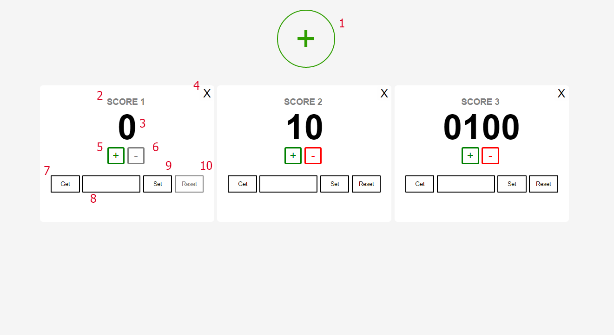

# Patronage 2017 - Zadanie 2 - Tomasz Wołoszyk

## Licznik (Score):

Każdy nowo tworzony licznik dostaje swoją unikatową nazwę, np. Score 1, i nie jest ona zmieniana. Zrobiłem to w ten sposób, ponieważ licznik można by uznać jako np. licznik punktów zawodnika z numerem startowym równym tejże wartości. W takim wypadku numer licznika musi pozostać niezmieniony.  
Następne liczniki dostają kolejne numery, które nie zostały jeszcze wykorzystane.

## fa

